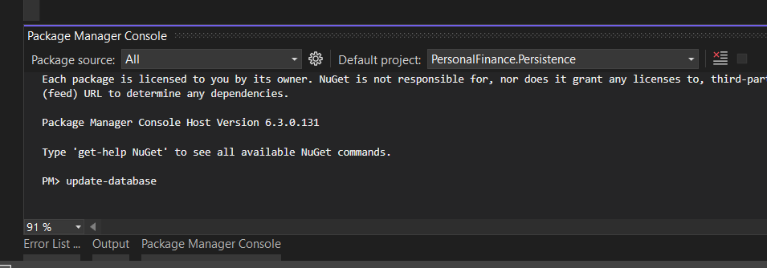

# PersonalFinance

PersonalFinance is an app which tracks your finance transactions history.
Application represents data as a graphical charts.

## Installation

1.Change your connection string in appsettings.json

```bash
"ConnectionStrings": {
    "PFConnectionString": "Server=.;Database=PFDb;Trusted_Connection=True;TrustServerCertificate=True;"
  },
```

2. Initiate database



Run `update-database` command in Package Manager Console in Persistance project


## Architecture

This is a web application, which uses Model-View-Controller (MVC) design patter.

Model part is supported by repository-service pattern, which contains businness logic with operations that should be performed by it.

Repository-Service pattern divides the business layer into two semi-layers. Repository handles getting data into and out of database.

Service is responsible for operations on data and passing them between repository and controller.

## Patterns/Technologies:

- ASP.NET Core
- Entity Framework
- Repository Pattern
- Fluent Validation
- AutoMapper
- JSON Web Token (JWT)

# Client

User interface is created with usage of React, a JavaScript library. In addition app is using Chat.js library, which provides charts.

Client sends requests on port: 7138 by default. You should check if it is proper path for your needs.

`const urlServer = 'https://localhost:7226/api/';`

## Instalation

Head to the terminal and the first thing you need to do is navigate to the directory where the app is installed using
`cd personalfinance.client`
Then finally run `npm-start` to see app live on localhost.

### `npm start`

Runs the app in the development mode.\
Open [http://localhost:3000](http://localhost:3000) to view it in the browser.

The page will reload if you make edits.\
You will also see any lint errors in the console.

## About

Solbeg 5th Task
